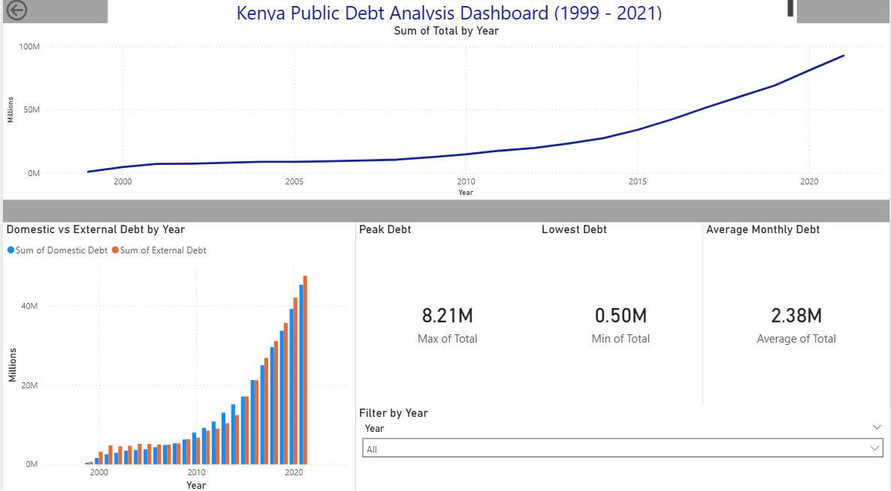

# 🇰🇪 Kenya Public Debt Analysis (1999–2021)

##  Project Overview
This project analyzes Kenya's public debt trends over 22 years (1999–2021) 
using Python, SQL, and Power BI. The goal was to explore debt growth patterns, 
uncover insights through SQL queries, and build a machine learning model to 
predict total public debt over time.

##  Dashboard Preview

##  Dataset
- **Source:** [Open Africa — Kenya Public Debt](https://open.africa/dataset/kenya-public-debt)
- **Records:** 262 rows | 5 columns
- **Period:** 1999 – 2021
- **Columns:** Year, Month, Domestic Debt, External Debt, Total Debt

##  Key Findings
- Kenya's public debt grew by over **1,500%** from 1999 to 2021
- Debt crossed **KES 1 Million** mark in the early 2000s
- **External debt consistently dominated** — averaging 60%+ of total debt
- Debt growth accelerated sharply **after 2015**
- Peak debt recorded was **KES 8.21M** in December 2021

##  Tools & Technologies
| Tool | Purpose |
|------|---------
| Python (pandas, matplotlib, sklearn) | Data cleaning, EDA, ML modelling |
| MySQL Workbench | SQL analysis and querying |
| Power BI | Interactive dashboard |
| GitHub | Version control and portfolio |

##  Machine Learning Model
- **Model:** Polynomial Regression (degree=3)
- **Features:** Time Index
- **Target:** Total Public Debt
- **R² Score:** 0.9069
- **MAE:** KES 283,394M
- **Approach:** Chronological train/test split (80/20)

##  Project Files
| File | Description |
|------|-------------|
| `public-debt-ksh-million.csv` | Original raw dataset |
| `clean_public_debt.csv` | Cleaned and processed dataset |
| `kenya_debt_prediction.ipynb` | Python EDA and ML notebook |
| `kenya_debt_analysis.sql` | SQL analysis queries |
| `kenya_public_debt_dashboard.pbix` | Power BI dashboard file |
| `kenya_public_debt_dashboard.png` | Dashboard screenshot |

##  Other Factors Affecting Public Debt
Beyond time trends, Kenya's debt is influenced by:
- GDP growth and tax revenue
- Exchange rate fluctuations (KES/USD)
- IMF and World Bank loan agreements
- Government infrastructure spending
- Inflation and interest rates
- COVID-19 pandemic borrowing (2020–2021)

## Author
**Naomi Sirya**  
Data Analytics | Python | SQL | Power BI  
[GitHub](https://github.com/umiSirya)
